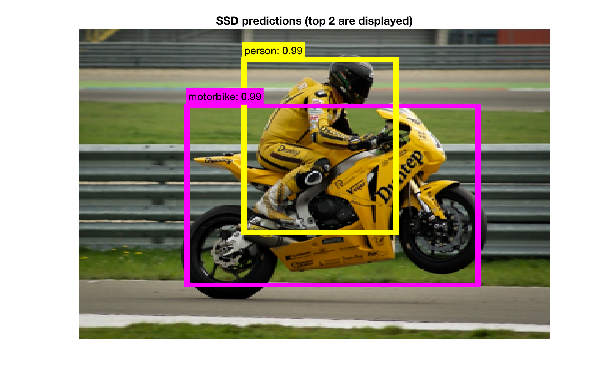

## Single Shot MultiBox Detector

**NOTICE: This repo is no longer maintained.  For an easy-to-use object detector that is actively maintained, I recommend considering the PyTorch Mask R-CNN [implementation](https://github.com/facebookresearch/maskrcnn-benchmark).**

This directory contains code to train and evaluate the SSD object detector
described in the paper:

```
SSD: Single Shot MultiBox Detector
by Wei Liu, Dragomir Anguelov, Dumitru Erhan, Christian Szegedy, 
Scott Reed, Cheng-Yang Fu, Alexander C. Berg
```

The code is based on the `caffe` implementation 
[made available](https://github.com/weiliu89/caffe/tree/ssd) by Wei Liu.

### Demo

Running the `ssd_demo.m` script will download a model trained on pascal voc 2007 data and run it on a sample image to produce the figure below:



### Performance

The `matconvnet` training code aims to reproduce the results
achieved by the `caffe` training routine.  Using the "zoom out"
data augmentation scheme described in the updated SSD paper
the model trained with `matconvnet` achieves
a similar mAP on the 2007 test set to the `caffe` model.

```
Test Set Results - comparison of the ssd-pascal-vggvd-300 model:

-------------- -------------------- ------------------------
               trained with caffe   trained with matconvnet
-------------- -------------------- ------------------------
aeroplane      80.53                82.39
bicycle        83.77                85.82
bird           76.40                77.40
boat           71.53                71.43
bottle         50.17                52.82
bus            86.90                86.54
car            86.05                86.20
cat            88.57                87.04
chair          59.96                60.07
cow            81.39                81.59
diningtable    76.30                75.57
dog            85.92                84.65
horse          86.60                86.65
motorbike      83.62                84.94
person         79.57                79.47
pottedplant    52.62                50.30
sheep          79.22                79.19
sofa           78.89                78.82
train          86.52                87.02
tvmonitor      76.31                77.15
-------------- -------------------- ------------------------
mean           77.54                77.75
-------------- -------------------- ------------------------
```

### Pre-trained models

The public `caffe` models released by Wei Liu have been imported into 
`matconvnet` for use.  The MobileNet model released by [chuanqi305](https://github.com/chuanqi305/MobileNet-SSD)
has also been imported. In addition, some sample models trained with the 
matconvnet implementation have been made available. These can be 
downloaded directly from 
[here](http://www.robots.ox.ac.uk/~albanie/mcn-models.html#ssd) (a few pre-trained 
models will be downloaded automatically upon running the 
`core/ssd_pretrained_benchmarks.m` script).

### Speed

The pre-trained `ssd-pascal-vggvd-300` model runs at approximately 
58 Hz on a Tesla M-40.

### Dependencies

`CPU-mode`:

* `matconvnet (tested with v1.0-beta23, v1.0-beta24)`
* `MATLAB (tested with 2016a)`


`additional GPU-mode dependency`:

* `CUDA (tested with v7.5, v8)`


`mcnSSD` also requires the following two modules:

* [autonn](https://github.com/vlfeat/autonn) - automatic differenation
* [mcnExtraLayers](https://github.com/albanie/mcnExtraLayers) - extra MatConvNet layers

Both of these can be setup directly with `vl_contrib` (i.e. run `vl_contrib install <module-name>` then `vl_contrib setup <module-name>`).

### Installation

The easiest way to use this module is to install it with the `vl_contrib` 
package manager. `mcnSSD` can be installed with 
the following commands from the root directory of your MatConvNet 
installation:

```
vl_contrib('install', 'mcnSSD') ;
vl_contrib('compile', 'mcnSSD') ;
vl_contrib('setup', 'mcnSSD') ;
vl_contrib('test', 'mcnSSD') ; % optional
```


### Demo

The `ssd_demo.m` script gives an example of how to run a pre-trained model 
on a single image.  The `core/ssd_pretrained_benchmarks.m` will download 
and evaluate a range of pre-trained SSD models on the `Pascal VOC 2007` test 
set.

An example of model training can be found in `pascal/ssd_pascal_train.m`


### FAQ

1. If you get the following error:  `Undefined function or variable 'vl_argparsepos'`, it indicates that autonn is not on your path.  It can be added by running `vl_contrib install autonn ; vl_contrib setup autonn ;` from the root of your MatConvNet install.

